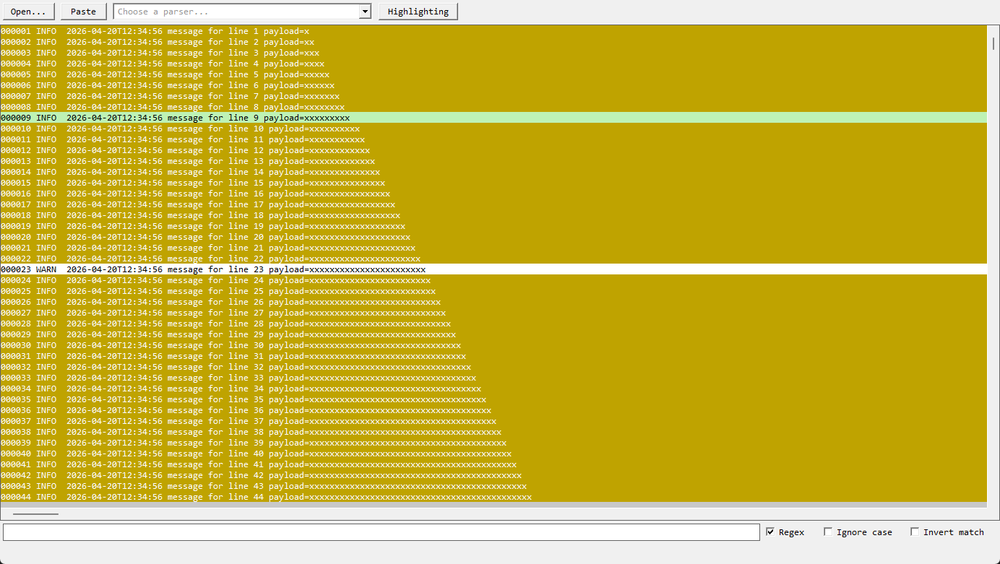

<p align="center">
  
</p>

<h1 align="center">LogBlade</h1>

<p align="center">
  A fast, portable Windows log viewer built directly on Win32.<br>
  Um visualizador de logs rápido e portátil para Windows, construído diretamente sobre Win32.
</p>

<p align="center">
  <a href="https://github.com/IanCastro/LogBlade/releases">Download</a> ·
  <a href="https://github.com/IanCastro/LogBlade/issues">Report an issue</a> ·
  <a href="#português">Português</a>
</p>



## English

LogBlade opens large text logs without building a global line index before showing the first viewport. The application is a native Windows desktop executable with no web view, installer, telemetry, or required .NET installation.

### Highlights

- Progressive, viewport-first loading for large files.
- Multi-stage text or regular-expression filtering.
- Configurable display parsers for structured log records.
- Custom highlighting rules with foreground, background, bold, and italic styles.
- Live updates when an open file grows.
- Open a file from the UI or command line, or paste text from the clipboard.
- Import and export parser and highlighting configurations.
- Portable NativeAOT executable for Windows x64.

### Install and run

1. Open the [Releases page](https://github.com/IanCastro/LogBlade/releases).
2. Download `LogBlade-<version>-win-x64.zip` and optionally verify it with `SHA256SUMS.txt`.
3. Extract the ZIP to a folder of your choice.
4. Run `LogBlade.exe`, then choose **Open...**, or pass a file on the command line:

```powershell
.\LogBlade.exe C:\logs\application.log
```

LogBlade supports Windows 10 and Windows 11 on x64 processors. Release builds are self-contained and do not require a separate .NET runtime.

> [!WARNING]
> The `0.1.0` beta is not digitally signed. Windows SmartScreen may display an “unrecognized app” warning. Only run a binary downloaded from this repository and verify its SHA-256 checksum before bypassing the warning.

### Supported text encodings

- UTF-8 with BOM
- UTF-16 LE with BOM
- UTF-16 BE with BOM
- Windows-1252 when no BOM is present

Application logs are stored under `%LOCALAPPDATA%\LogBlade\logs`, with `%TEMP%\LogBlade\logs` as a fallback. LogBlade processes files locally and does not send telemetry.

### Build from source

Requirements: Windows x64 and the .NET 8 SDK with the NativeAOT build prerequisites.

```powershell
.\test-back.ps1
.\test-front.ps1
.\package.ps1 -Version 0.1.0-beta.2 -RequireNativeAot
.\release.ps1 -Version 0.1.0-beta.2 -RequireNativeAot
```

The final ZIP and checksum file are written to `artifacts\release`.

## Português

O LogBlade abre logs de texto grandes sem precisar criar um índice global de linhas antes de mostrar a primeira tela. O aplicativo é um executável desktop nativo para Windows, sem web view, instalador, telemetria ou instalação separada do .NET.

### Principais recursos

- Carregamento progressivo que prioriza a área visível em arquivos grandes.
- Filtros de texto ou expressão regular em múltiplas etapas.
- Parsers configuráveis para exibir registros estruturados.
- Regras de destaque com cores, negrito e itálico.
- Atualização ao vivo quando o arquivo aberto cresce.
- Abertura pela interface ou linha de comando e leitura de texto da área de transferência.
- Importação e exportação de configurações de parser e destaque.
- Executável NativeAOT portátil para Windows x64.

### Instalação e uso

1. Abra a [página de Releases](https://github.com/IanCastro/LogBlade/releases).
2. Baixe `LogBlade-<versão>-win-x64.zip` e, opcionalmente, confira o arquivo `SHA256SUMS.txt`.
3. Extraia o ZIP para qualquer pasta.
4. Execute `LogBlade.exe` e selecione **Open...**, ou passe o arquivo pela linha de comando:

```powershell
.\LogBlade.exe C:\logs\aplicacao.log
```

O LogBlade suporta Windows 10 e Windows 11 em processadores x64. As releases são autocontidas e não exigem uma instalação separada do .NET.

> [!WARNING]
> A beta `0.1.0` ainda não possui assinatura digital. O Windows SmartScreen pode mostrar um aviso de “aplicativo não reconhecido”. Execute somente o binário baixado deste repositório e confira o SHA-256 antes de ignorar o aviso.

Os logs do próprio aplicativo ficam em `%LOCALAPPDATA%\LogBlade\logs`, com fallback para `%TEMP%\LogBlade\logs`. Todo o processamento ocorre localmente e nenhuma telemetria é enviada.

## License

LogBlade is available under the [MIT License](LICENSE).
